# Biblioteca-C2S2

# Cómo comenzar:
1. Clonar el repositorio e ir a la consola y colocar el siguiente comando:

```
    pip install -r requirements.txt
```
Ahora que ya tenemos todas las dependencias instaladas en nuestra computadora, entonces podemos pasar al siguiente paso.

2. Ahora, ejecutaremos el proyecto con el siguiente comando:

```
    py manage.py runserver
```

3. Listo, ahora en la consola te deberia salir una imagen como las siguiente y deberas hacer ctrl + click en la url que te señalo adelante:

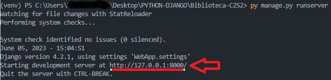
> P/D: Intentá no romperlo 😅

# Funcionalidades por entidad

## 1. Autores

* Agregar un nuevo autor
    ```
    http://127.0.0.1:8000/autores/nuevo
    ```
* Activar un autor
    ```
    http://127.0.0.1:8000/autores/activar/(id del autor)
    ```
* Desactivar un autor
    ```
    http://127.0.0.1:8000/autores/desactivar/(id del autor)
    ```
* Modificar un autor existente
    ```
    http://127.0.0.1:8000/autores/modificar/(id del autor)
    ```
* Eliminar un autor existente
    ```
    http://127.0.0.1:8000/autores/eliminar/(id del autor)
    ```
* Ver el listado de todos los autores existentes
    ```
    http://127.0.0.1:8000/autores/listado
    ```
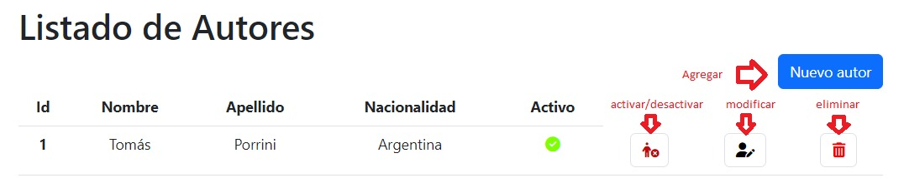
## 2. Empleados

* Agregar un nuevo empleado
    ```
    http://127.0.0.1:8000/empleados/nuevo
    ```
* Activar un empleado
    ```
    http://127.0.0.1:8000/empleados/activar/(id del empleado)
    ```
* Desactivar un empleado
    ```
    http://127.0.0.1:8000/empleados/desactivar/(id del empleado)
    ```
* Modificar un empleado existente
    ```
    http://127.0.0.1:8000/empleados/modificar/(id del empleado)
    ```
* Eliminar un empleado existente
    ```
    http://127.0.0.1:8000/empleados/eliminar/(id del empleado)
    ```
* Ver el listado de todos los empleados existentes
    ```
    http://127.0.0.1:8000/empleados/listado
    ```
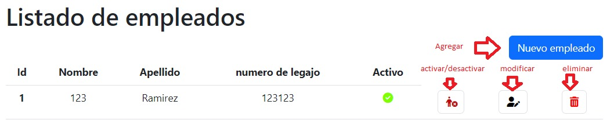
## 3. Libros

* Agregar un nuevo libro
    ```
    http://127.0.0.1:8000/libros/nuevo
    ```
* Activar un libro
    ```
    http://127.0.0.1:8000/libros/activar/(id del libro)
    ```
* Desactivar un libro
    ```
    http://127.0.0.1:8000/libros/desactivar/(id del libro)
    ```
* Modificar un libro existente
    ```
    http://127.0.0.1:8000/libros/modificar/(id del libro)
    ```
* Eliminar un libro existente
    ```
    http://127.0.0.1:8000/libros/eliminar/(id del libro)
    ```
* Ver el listado de todos los libros existentes
    ```
    http://127.0.0.1:8000/libros/listado
    ```
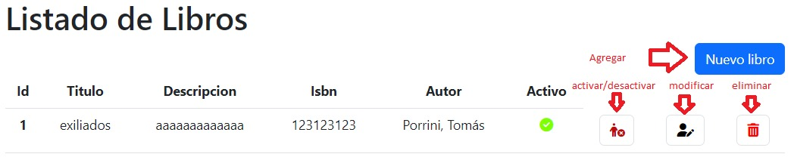
## 4. Socios

* Agregar un nuevo socio
    ```
    http://127.0.0.1:8000/socios/nuevo
    ```
* Activar un socio
    ```
    http://127.0.0.1:8000/socios/activar/(id del socio)
    ```
* Desactivar un socio
    ```
    http://127.0.0.1:8000/socios/desactivar/(id del socio)
    ```
* Modificar un socio existente
    ```
    http://127.0.0.1:8000/socios/modificar/(id del socio)
    ```
* Eliminar un socio existente
    ```
    http://127.0.0.1:8000/socios/eliminar/(id del socio)
    ```
* Ver el listado de todos los socios existentes
    ```
    http://127.0.0.1:8000/socios/listado
    ```
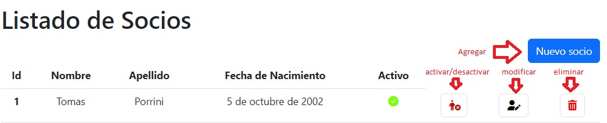

## 5. Prestamos de Libros

* Agregar un nuevo prestamo
    ```
    http://127.0.0.1:8000/prestamos/nuevo
    ```
* Modificar un prestamo existente
    ```
    http://127.0.0.1:8000/prestamos/modificar/(id del prestamo)
    ```
* Eliminar un prestamo existente
    ```
    http://127.0.0.1:8000/prestamos/eliminar/(id del prestamo)
    ```
* Ver el listado de todos los prestamos existentes
    ```
    http://127.0.0.1:8000/prestamos/listado
    ```
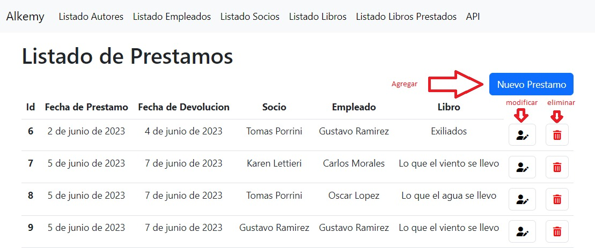


# API DEL PROYECTO

Tenemos un menú de api que se puede acceder desde: 

    ```
    http://127.0.0.1:8000/api
    ```

Donde se mostrara algo como esto:

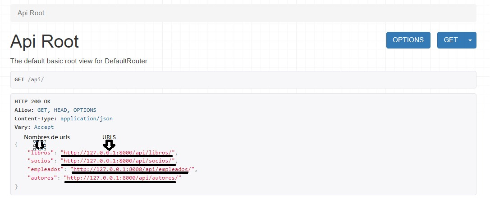

Y nosotros podemos apretar cada uno de esas URL's para acceder a los menues de los libros, los socios, los empleados y los autores.

# FUNCIONES DE URL DE API

## 1. Listado de Libros

* GET:

    - Para obtener todos los libros

    ```
    http://127.0.0.1:8000/api/libros
    ```
    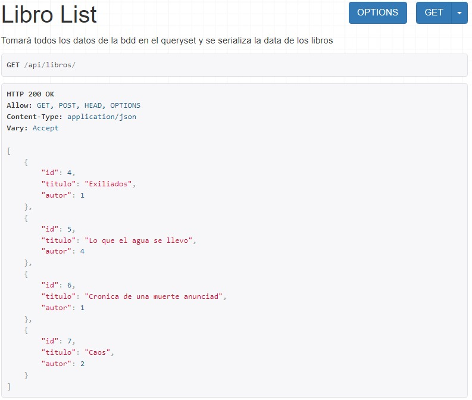

    - Para obtener un libro especifico: donde tenemos que agregar al final de la url un ID del libro que queremos, como por ejemplo:

    ```
    http://127.0.0.1:8000/api/libros/4
    ```

    


## 2. Listado de socios

* GET:

    - Para obtener todos los socios

    ```
    http://127.0.0.1:8000/api/socios
    ```

    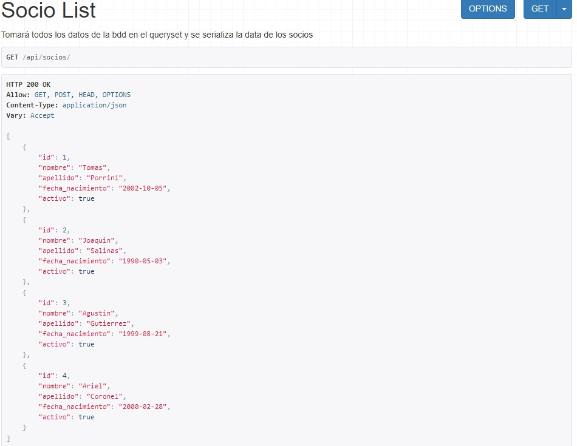

    - Para obtener un socio especifico: donde tenemos que agregar al final de la url un ID del socio que queremos, como por ejemplo:

    ```
    http://127.0.0.1:8000/api/socios/1
    ```

    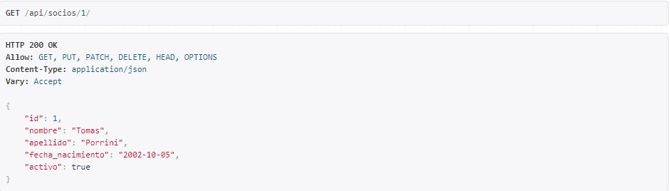

## 3. Listado de empleados

* GET:

    - Para obtener todos los empleados

    ```
    http://127.0.0.1:8000/api/empleados
    ```

    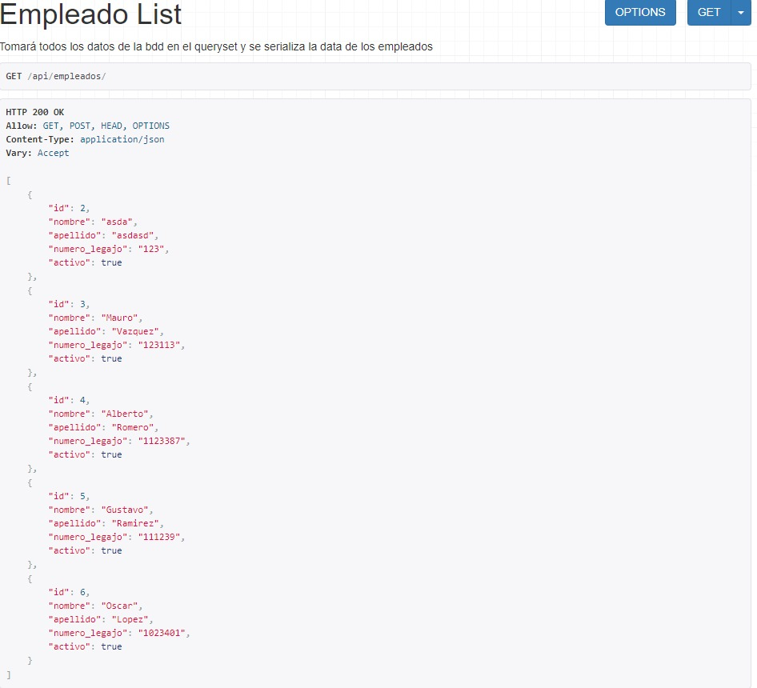

    - Para obtener un empleado especifico: donde tenemos que agregar al final de la url un ID del empleado que queremos, como por ejemplo:

    ```
    http://127.0.0.1:8000/api/empleados/2
    ```

    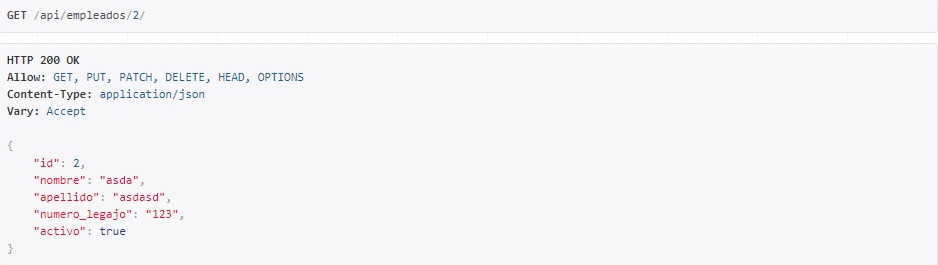

## 4. Listado de autores

* GET:

    - Para obtener todos los autores

    ```
    http://127.0.0.1:8000/api/autores
    ```

    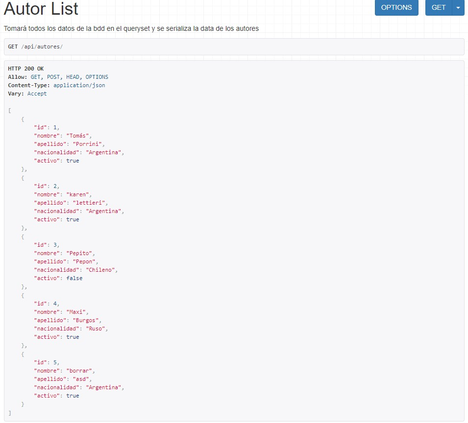

    - Para obtener un autor especifico: donde tenemos que agregar al final de la url un ID del autor que queremos, como por ejemplo:

    ```
    http://127.0.0.1:8000/api/autores/4
    ```

    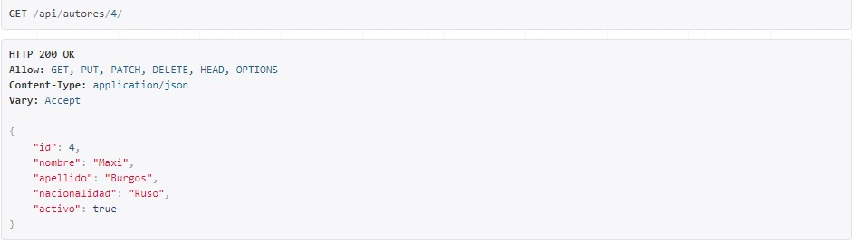

> Cabe resaltar, que como esta API está implementada por medio de routers, tiene predefinido todas las funciones de un CRUD (Create - Read - Update - Delete). Por lo tanto tienen implementadas los formatos GET, POST y DELETE.


## INTEGRANTES

    1. Oscar López.
    2. Gustavo Ramirez.
    3. Carlos Morales.
    4. Tomás Porrini
    5. Franco Campos

## Agradecemos a:

- Alkemy: Por todo lo brindado en el campus y por la buena onda desde el comienzo en cada clase presentando todo de manera didáctica y divertida.

- Maximiliano Burgos: Nuestro querido mentor, por todo lo que nos estuvo enseñando y bancando desde el comienzo. Muy buen mentor y lider técnico en este y todos los proyectos realizados.